# RENAC Wallbox — Home Assistant Integration

> [!CAUTION]
> **⛔ 100% AI-GENERATED / "VIBE-CODED" — NOT REVIEWED BY A PROFESSIONAL DEVELOPER. USE ENTIRELY AT YOUR OWN RISK. ⛔**
> Every line of code, every API endpoint, and this documentation were produced by an AI coding agent through reverse engineering of a closed, undocumented cloud API — no human software engineer has audited this code for correctness or safety. It reads (and, if you extend it, could write) data related to your home's electrical/EV-charging equipment through your real RENAC account credentials. There is **no warranty of any kind** and the author accepts **no liability whatsoever** for any damage, data loss, account lockout, incorrect readings, or electrical/hardware issues arising from using this project. See [LICENSE](LICENSE). If that's not acceptable to you, don't use this.

Custom Home Assistant integration that reads live telemetry from a **RENAC AC wallbox** (EV charger) via the RENAC cloud portal at `https://seceu.renacpower.com` (and its regional siblings). No local/LAN API exists for these devices — everything goes through RENAC's cloud, so this integration talks to the same backend the web portal uses.

> ✅ **Successfully tested end-to-end on a real RENAC EV-AC3P-11K wallbox.**

> 📖 Looking for the reverse-engineered API contract, code architecture, known gaps, or how to run the tests? See **[docs/API.md](docs/API.md)**. This README is just the install/usage guide.

> 🇨🇿 Návod v češtině je níže, za anglickým. / 🇬🇧 English guide first, Czech version below.

---

## Install via HACS

This repository is a valid **HACS custom repository** (see [`hacs.json`](hacs.json)).

1. In Home Assistant, open **HACS**.
2. Go to **Integrations**, click the **⋮** menu (top right) → **Custom repositories**.
3. Add:
   - **Repository:** `https://github.com/ondrej1808/HA_renac_inverter_api`
   - **Category:** `Integration`
   - Click **Add**.
4. Find **"RENAC Wallbox"** in HACS (search for it, or it will appear under *New* on the HACS Integrations dashboard) and click **Download**.
5. **Restart Home Assistant** (Settings → System → Restart) — required for HA to pick up the new `custom_components/renac_wallbox/` folder.
6. Go to **Settings → Devices & Services → Add Integration**, search for **"RENAC Wallbox"**.
7. Enter the **API base URL** (leave the default for the Europe region unless you know you need a different one), and the **same email/password you use to log in at seceu.renacpower.com**.
8. If your account has more than one wallbox station, pick the one you want. If that station has more than one device, pick its serial number.
9. Done — entities appear under one device per wallbox. Repeat step 6–9 once per additional wallbox if you have more than one.

**Credentials handling:** your email/password are stored only inside Home Assistant's own config-entry storage (the same mechanism every other HA integration uses) and are sent only to the RENAC cloud API (`api/user/login`) over HTTPS, exactly like the official RENAC web portal does. They are never sent anywhere else, never logged, and never included in this repository, its README, or any file committed here.

**Manual (non-HACS) installation:**
1. Copy `custom_components/renac_wallbox/` into your Home Assistant `config/custom_components/` directory.
2. Restart Home Assistant.
3. Settings → Devices & Services → Add Integration → search "RENAC Wallbox".

**Screenshots of the full flow:**

**1. HACS in the sidebar** once installed and authorized against GitHub.
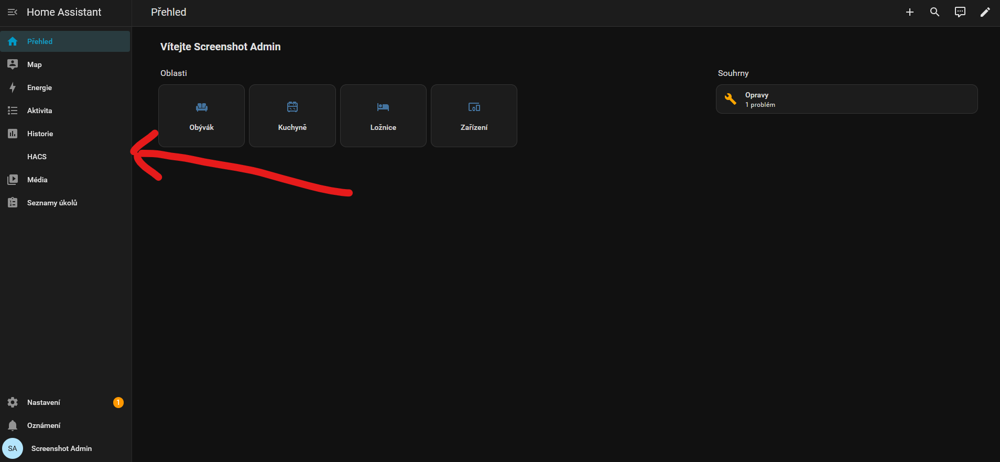

**2. HACS → ⋮ → Custom repositories**
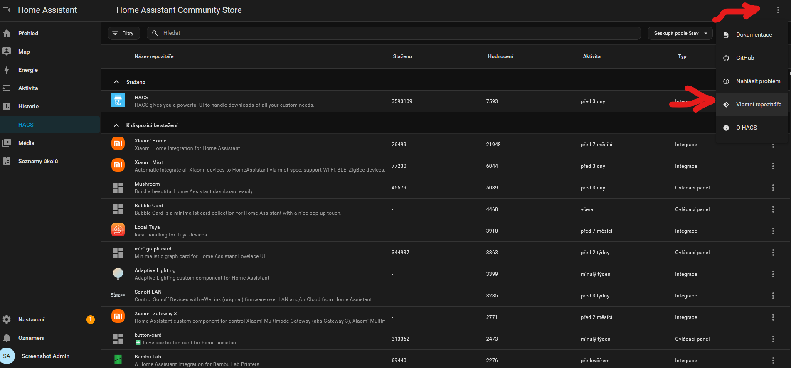

**3. Add this repo** as an Integration-type custom repository.
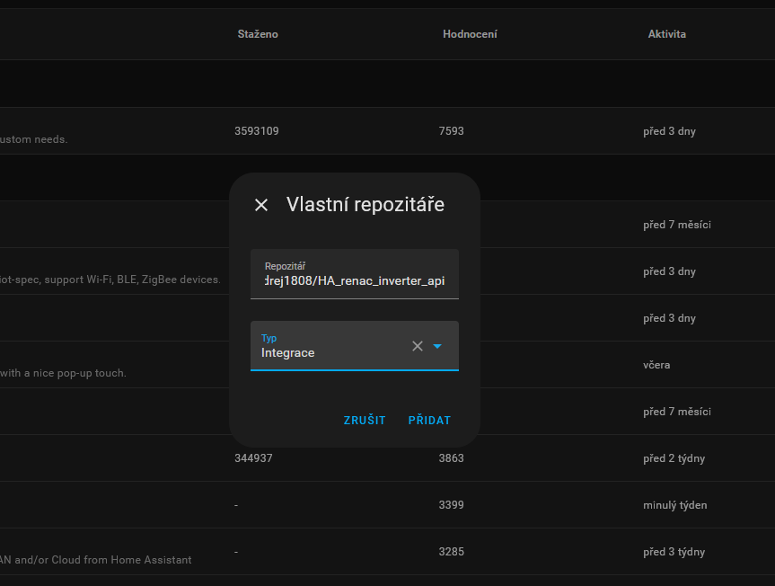

**4. Search "renac"** in HACS to find it.
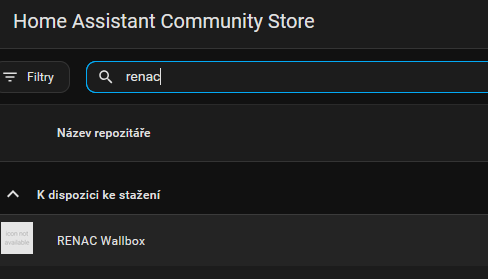

**5. Download** the integration.
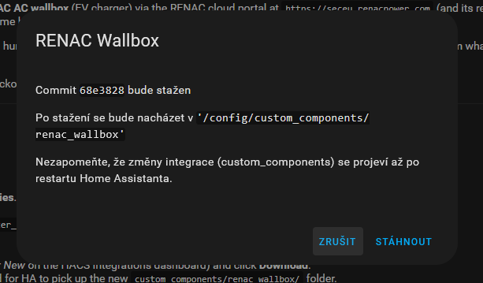

**6. HACS flags that a restart is required.**
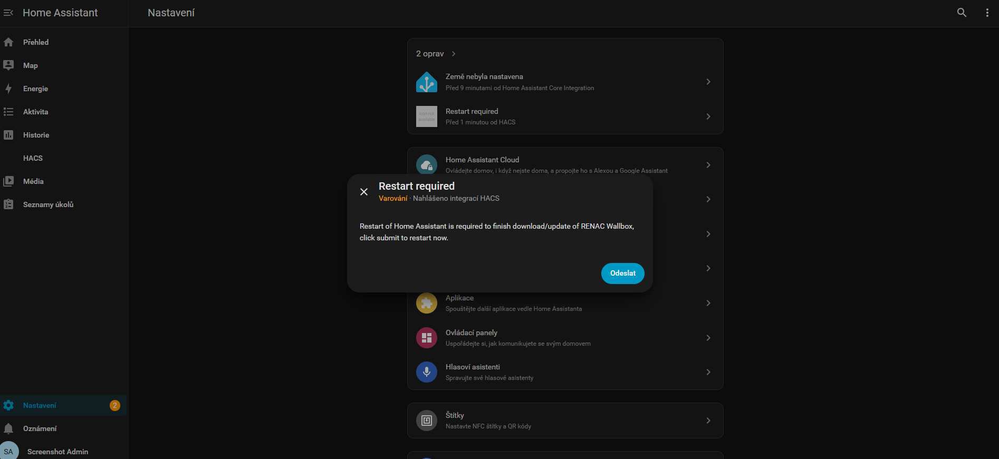

**7. Settings, before restart** — the repair item is queued.
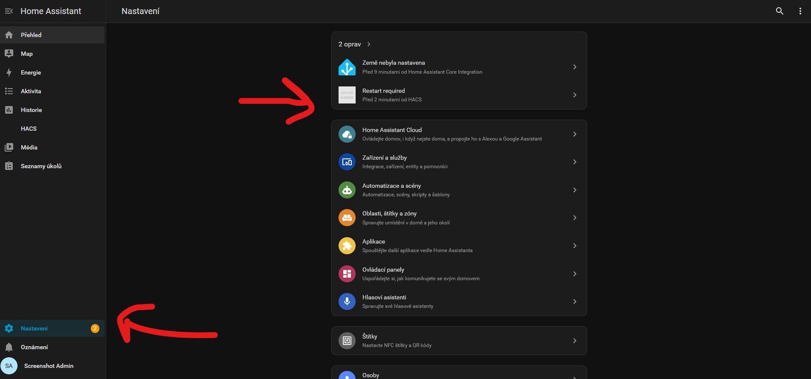

**8. Settings, after restart** — repair cleared, HA confirms it restarted.
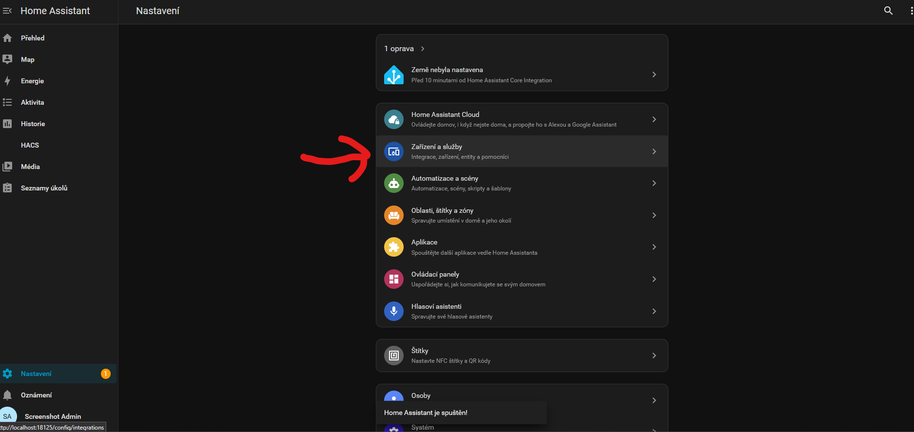

**9. Devices & Services → Add Integration.**
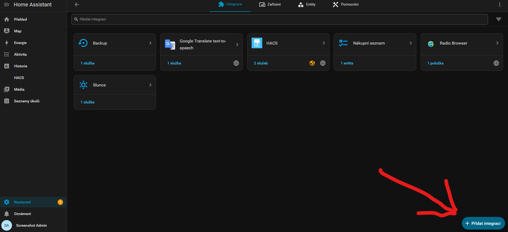

**10. Search "renac"** in the brand picker.
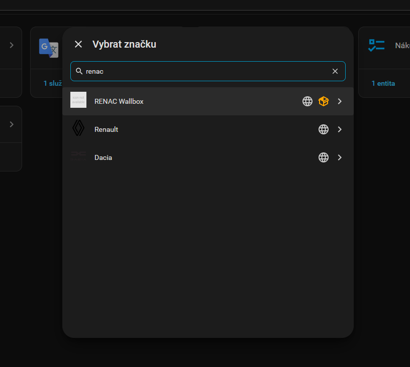

**11. The config flow form** — base URL is pre-filled, enter your RENAC email/password here.
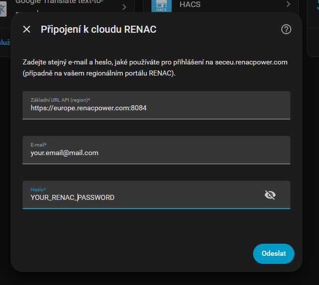

**12. Optional device naming/area step**, then finish.
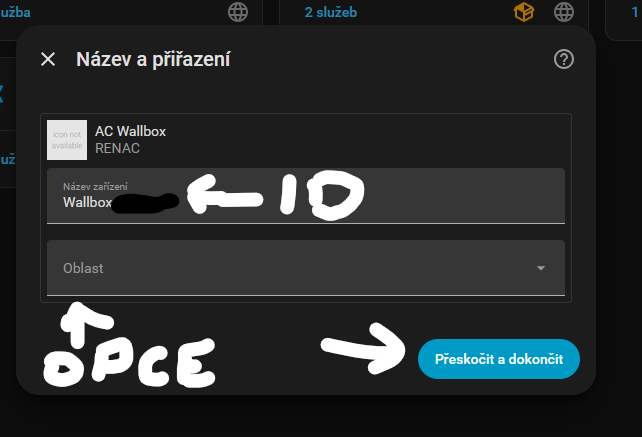

---

## Using the integration

**Config flow steps:**
1. Enter API base URL (defaults to the confirmed Europe endpoint), email, password — same credentials as `seceu.renacpower.com`.
2. If the account has more than one wallbox station, pick one.
3. If that station has more than one device, pick a serial number (auto-detected in the vast majority of cases).
4. Entities are created under one device per `inv_sn`.

Polling interval defaults to 30s and can be changed afterwards via the integration's **Configure** (options flow), 10–3600s.

**Read-only sensors** (confirmed against real hardware): power (W), voltage (V), current (A), total energy (kWh), session energy (kWh), total cost, session cost, session duration, state (`idle`/`plugged_in`/`charging`/`fault`), phase (`single_phase`/`three_phase`), max power limit, PV minimum solar power threshold (diagnostic), plus a `problem` binary sensor for fault state.

**✅ `switch.*_charging`** — turn charging on/off. Unlike everything else below, this one is **confirmed live**: captured from a real "turn on"/"turn off charging" click in the web portal. `is_on` reflects the wallbox's actual reported state, not just the last command sent.

**Editable settings** — 24 more entities across `number`/`select`/`switch`/`time` (max current, protect temperature, meter address, charge mode, PV boost, off-peak schedule, load balancing, fast-charge schedule, and more). ⚠️ These were derived from decompiled JS and tested end-to-end against a mock server (no errors, correct payloads confirmed) but **not yet against a real account** — see the full field-by-field table in [docs/API.md §2.10](docs/API.md) before relying on them, and start with something low-risk (like the meter address) rather than current/power settings.

**Security, in short:** the RENAC login endpoint accepts a plaintext password over HTTPS (no client-side hashing to preserve). This integration only ever *reads* data — it never writes to `api/charging/set` or any other control endpoint. See [docs/API.md §4.1](docs/API.md) for the full write-up.

## License

[Unlicense](LICENSE) — public domain, do whatever you want, no warranty, no liability.

---
---

# 🇨🇿 RENAC Wallbox — integrace pro Home Assistant

> [!CAUTION]
> **⛔ 100 % VYGENEROVÁNO AI / "VIBE-CODED" — NEZKONTROLOVÁNO PROFESIONÁLNÍM VÝVOJÁŘEM. POUŽÍVÁTE ZCELA NA VLASTNÍ RIZIKO. ⛔**
> Každý řádek kódu, každý API endpoint i celá tato dokumentace vznikly prací AI agenta reverzním inženýrstvím uzavřeného, nedokumentovaného cloudového API — žádný člověk-vývojář tento kód neauditoval z hlediska správnosti ani bezpečnosti. Čte (a pokud si ho rozšíříte, mohl by i zapisovat) data týkající se elektrického/EV-nabíjecího zařízení ve vaší domácnosti, a to pomocí vašich skutečných přihlašovacích údajů k účtu RENAC. Nejsou poskytovány **žádné záruky** a autor **nenese žádnou odpovědnost** za jakoukoli škodu, ztrátu dat, zablokování účtu, nesprávná čtení nebo elektrické/hardwarové problémy vzniklé používáním tohoto projektu. Viz [LICENSE](LICENSE). Pokud to pro vás není přijatelné, tento projekt nepoužívejte.

Vlastní (custom) integrace pro Home Assistant, která čte živá data z **AC wallboxu RENAC** (nabíječky pro elektromobily) přes cloudový portál RENAC na `https://seceu.renacpower.com` (a jeho regionální varianty). Tato zařízení nemají žádné lokální/LAN API — vše jde přes cloud RENAC, takže integrace komunikuje se stejným backendem jako webový portál.

> ✅ **Úspěšně otestováno end-to-end na reálném wallboxu RENAC EV-AC3P-11K.**

> 📖 Hledáte reverzně odvozený kontrakt API, architekturu kódu, známé mezery nebo jak spustit testy? Viz **[docs/API.md](docs/API.md)**. Toto README je jen návod k instalaci a použití.

> 🇬🇧 English guide first, above.

---

## Instalace přes HACS

Tento repozitář je platný **vlastní (custom) repozitář HACS** (viz [`hacs.json`](hacs.json)).

1. V Home Assistant otevřete **HACS**.
2. Přejděte na **Integrations**, klikněte na nabídku **⋮** (vpravo nahoře) → **Custom repositories**.
3. Přidejte:
   - **Repository:** `https://github.com/ondrej1808/HA_renac_inverter_api`
   - **Category:** `Integration`
   - Klikněte na **Add**.
4. Najděte **"RENAC Wallbox"** v HACS (vyhledejte ho, nebo se objeví v sekci *New* na dashboardu HACS Integrations) a klikněte na **Download**.
5. **Restartujte Home Assistant** (Nastavení → Systém → Restartovat) — nutné, aby HA načetl novou složku `custom_components/renac_wallbox/`.
6. Přejděte na **Nastavení → Zařízení a služby → Přidat integraci**, vyhledejte **"RENAC Wallbox"**.
7. Zadejte **základní URL API** (ponechte výchozí pro region Evropa, pokud si nejste jisti, že potřebujete jinou) a **stejný e-mail/heslo, jaké používáte pro přihlášení na seceu.renacpower.com**.
8. Pokud má váš účet více wallbox stanic, vyberte tu správnou. Pokud má daná stanice více zařízení, vyberte jeho sériové číslo.
9. Hotovo — entity se objeví pod jedním zařízením na wallbox. Pro každý další wallbox opakujte kroky 6–9.

**Zacházení s přihlašovacími údaji:** váš e-mail/heslo se ukládají pouze v rámci vlastního úložiště config entry Home Assistant (stejný mechanismus jako u každé jiné integrace HA) a odesílají se pouze do cloudového API RENAC (`api/user/login`) přes HTTPS — přesně tak, jak to dělá i oficiální webový portál RENAC. Nikam jinam se neposílají, nikde se nelogují a nejsou nikde součástí tohoto repozitáře, jeho README ani žádného zde uloženého souboru.

**Ruční instalace (bez HACS):**
1. Zkopírujte `custom_components/renac_wallbox/` do adresáře `config/custom_components/` vašeho Home Assistant.
2. Restartujte Home Assistant.
3. Nastavení → Zařízení a služby → Přidat integraci → hledejte "RENAC Wallbox".

**Screenshoty celého postupu:**

**1. HACS v levém menu** po instalaci a autorizaci přes GitHub.

**2. HACS → ⋮ → Vlastní repozitáře**

**3. Přidejte tento repozitář** jako vlastní repozitář typu Integrace.

**4. Vyhledejte "renac"** v HACS.

**5. Stáhněte** integraci.

**6. HACS nahlásí, že je potřeba restart.**

**7. Nastavení, před restartem** — oprava čeká ve frontě.

**8. Nastavení, po restartu** — oprava zmizela, HA potvrzuje restart.

**9. Zařízení a služby → Přidat integraci.**

**10. Vyhledejte "renac"** ve výběru značky.

**11. Formulář config flow** — základní URL je přednastavená, sem zadáte svůj RENAC e-mail/heslo.

**12. Volitelný krok pojmenování zařízení/oblasti**, pak dokončit.

---

## Používání integrace

**Kroky config flow:**
1. Zadejte základní URL API (výchozí je ověřený evropský endpoint), e-mail a heslo — stejné přihlašovací údaje jako na `seceu.renacpower.com`.
2. Pokud má účet více wallbox stanic, vyberte jednu.
3. Pokud má daná stanice více zařízení, vyberte sériové číslo (ve valné většině případů se detekuje automaticky).
4. Entity se vytvoří pod jedním zařízením na `inv_sn`.

Výchozí interval dotazování je 30 s, lze změnit později přes **Konfigurovat** u integrace (options flow), v rozsahu 10–3600 s.

**Pouze ke čtení senzory** (ověřeno na reálném hardwaru): výkon (W), napětí (V), proud (A), celková energie (kWh), energie relace (kWh), celkové náklady, náklady relace, doba trvání relace, stav (`idle`/`plugged_in`/`charging`/`fault`), fáze (`single_phase`/`three_phase`), limit max. výkonu, PV práh minimálního solárního výkonu (diagnostický), plus binární senzor `problem` pro stav poruchy.

**✅ `switch.*_charging`** — zapnout/vypnout nabíjení. Na rozdíl od všeho níže je tato entita **ověřená naživo**: zachycena z reálného kliknutí na "zapnout"/"vypnout nabíjení" ve webovém portálu. `is_on` odráží skutečně hlášený stav wallboxu, ne jen poslední odeslaný příkaz.

**Editovatelná nastavení** — 24 dalších entit napříč `number`/`select`/`switch`/`time` (max. proud, ochranná teplota, adresa elektroměru, režim nabíjení, PV boost, rozvrh nízkého tarifu, vyvažování zátěže, plán rychlého nabíjení a další). ⚠️ Byla odvozena z dekompilovaného JS a otestována end-to-end proti mock serveru (bez chyb, správný payload potvrzen), ale **zatím ne proti reálnému účtu** — kompletní tabulku pole po poli najdete v [docs/API.md §2.10](docs/API.md), než se na ně spolehnete, a začněte něčím nízkorizikovým (třeba adresou elektroměru), ne nastavením proudu/výkonu.

**Bezpečnost ve zkratce:** přihlašovací endpoint RENAC přijímá heslo v čistém textu přes HTTPS (na klientovi není žádné hashování, které by bylo třeba zachovat). Tato integrace pouze *čte* data — nikdy nezapisuje do `api/charging/set` ani jiného řídicího endpointu. Kompletní rozbor viz [docs/API.md §4.1](docs/API.md).

## Licence

[Unlicense](LICENSE) — public domain, dělejte si s tím co chcete, žádná záruka, žádná odpovědnost.
